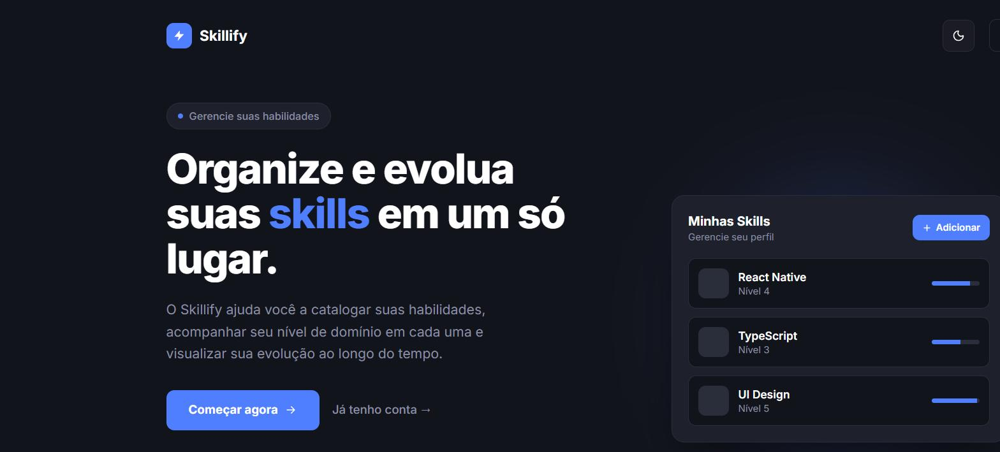
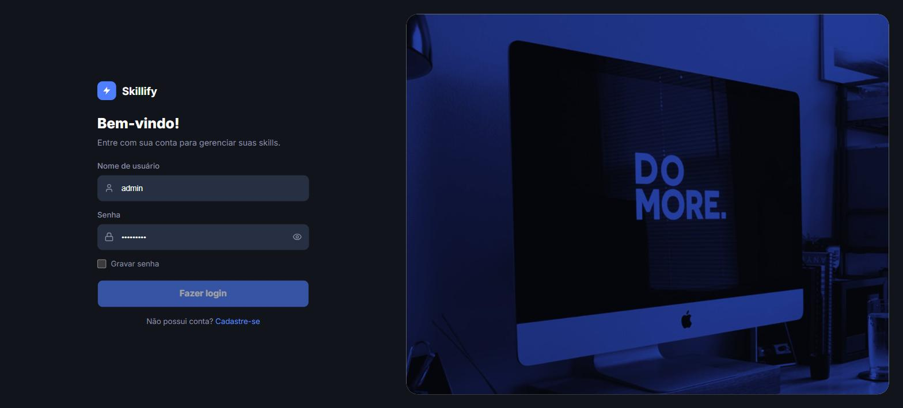
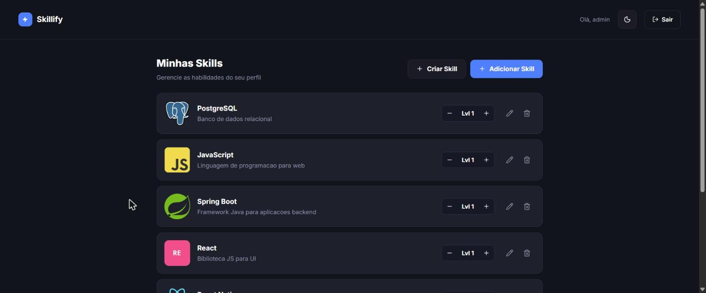

# Skillify

Aplicação web para catalogar habilidades técnicas e acompanhar a evolução de nível em cada uma delas. Construída como projeto de portfólio, com foco em arquitetura de frontend organizada, formulários validados, autenticação com controle de acesso por papel (role) e uma experiência de UI cuidada em tema claro/escuro.


---

## Sumário

- [Sobre o projeto](#sobre-o-projeto)
- [Screenshots](#screenshots)
- [Funcionalidades](#funcionalidades)
- [Stack técnica](#stack-técnica)
- [Arquitetura do frontend](#arquitetura-do-frontend)
- [Estrutura de pastas](#estrutura-de-pastas)
- [Pré-requisitos](#pré-requisitos)
- [Como executar o projeto](#como-executar-o-projeto)
- [Scripts disponíveis](#scripts-disponíveis)
- [Qualidade de código](#qualidade-de-código)
- [Decisões técnicas](#decisões-técnicas)
- [Autor](#autor)

## Sobre o projeto

O **Skillify** permite que cada usuário monte seu próprio "mapa de habilidades": adiciona skills de um catálogo, define um nível de domínio (1 a 5) e acompanha essa evolução ao longo do tempo. Administradores, além disso, gerenciam o catálogo de skills disponível para todos os usuários (criação e edição de nome, descrição e imagem).

O projeto foi desenvolvido consumindo uma API REST própria (Spring Boot + Spring Security com JWT), não incluída neste repositório, responsável por autenticação, autorização por papel (`ADMIN` / `USER`) e persistência dos dados.

## Screenshots

| Landing page | Login |
| --- | --- |
|  |  |

| Home — gestão de skills (visão admin) |
| --- |
|  |

## Funcionalidades

**Autenticação e sessão**
- Cadastro e login com validação de formulário (React Hook Form + Zod, mensagens em pt-BR).
- Sessão persistida em `localStorage`, com renovação automática do estado de autenticação ao recarregar a página.
- Opção de "gravar senha" no dispositivo, com aviso explícito de que a senha fica salva sem criptografia — uma escolha de transparência com o usuário, não de segurança.
- Logout com invalidação da sessão local.

**Controle de acesso por papel**
- Usuários comuns gerenciam apenas suas próprias skills (adicionar, ajustar nível, remover).
- Administradores enxergam e gerenciam o catálogo completo de skills, com ações extras (criar/editar skill) liberadas apenas para esse papel — tanto na interface quanto respeitadas pela API.

**Gestão de skills**
- Adicionar uma skill do catálogo ao próprio perfil, com nível inicial (1–5).
- Ajustar o nível de domínio a qualquer momento (+/-), com atualização otimista na UI.
- Criar uma nova skill no catálogo (nome, descrição, imagem) — apenas admin.
- Editar dados de uma skill existente do catálogo — apenas admin.
- Remover uma skill do próprio perfil, com confirmação inline antes da exclusão.
- Estados de carregamento (skeleton) e de lista vazia tratados de forma dedicada.

**Experiência de UI**
- Tema claro/escuro com persistência de preferência (`ThemeProvider` + `localStorage`), respeitando a escolha em toda a aplicação.
- Notificações (toast) de sucesso/erro para as ações assíncronas.
- Componentes de UI baseados em [shadcn/ui](https://ui.shadcn.com/) sobre Radix UI, com Tailwind CSS v4.
- Layout responsivo, do formulário de login à listagem de skills.

## Stack técnica

| Camada | Tecnologias |
| --- | --- |
| Framework / build | React 19, TypeScript, Vite 8 |
| Estilização | Tailwind CSS v4, shadcn/ui (Radix UI), `class-variance-authority`, `tailwind-merge` |
| Roteamento | React Router v8 |
| Formulários e validação | React Hook Form, Zod, `@hookform/resolvers` |
| HTTP client | Axios (interceptors para token JWT e tratamento padronizado de erros) |
| Ícones / fontes | lucide-react, Geist (via `@fontsource-variable`) |
| Qualidade | ESLint + typescript-eslint |

## Arquitetura do frontend

O projeto segue uma separação em três camadas para cada tela, pensada para manter páginas finas e regras de UI/negócio isoladas por responsabilidade:

```
Página (src/pages)        → compõe seções, sem lógica de formulário
  └─ Seção (src/components/sections)  → layout, copy e chrome visual
       └─ Formulário (src/components/form)  → react-hook-form + schema Zod
```

Outros pontos da arquitetura:

- **Alias de import** `@/*` apontando para `src/*`, evitando `../../../` em todo o projeto.
- **Contextos React** (`src/contexts`) para autenticação (`authContext`), tema (`theme-provider`) e notificações (`toastContext`), evitando prop-drilling.
- **Camada de serviços** (`src/services`) isolando toda a comunicação HTTP (`api.ts` com a instância Axios e interceptors; `skills-api.ts` e `storage.ts` com as chamadas específicas), para que componentes nunca falem diretamente com `fetch`/`axios`.
- **Validação colocada** (`src/validators`): cada formulário tem seu schema Zod correspondente, com tipos inferidos (`z.infer`) reaproveitados no `useForm`.
- **Rotas protegidas**: `RootRoute` decide entre `PublicRoutes` (landing, login, cadastro) e `PrivateRoutes` (área logada) com base no estado de autenticação.

## Estrutura de pastas

```
src/
├─ components/
│  ├─ form/         # Formulários (login, cadastro) com react-hook-form + Zod
│  ├─ sections/      # Blocos de layout reutilizados pelas páginas
│  ├─ skills/         # Componentes específicos do domínio de skills
│  └─ ui/                # Primitivos shadcn/ui (button, input, select, toast...)
├─ contexts/         # AuthContext, ThemeProvider, ToastContext
├─ lib/                    # Utilitários (cn/clsx + tailwind-merge)
├─ pages/                # Landing, Login, Register, Home
├─ routes/              # RootRoute, PublicRoutes, PrivateRoutes
├─ services/            # Axios instance, chamadas de API, storage (localStorage)
└─ validators/         # Schemas Zod por formulário
```

## Pré-requisitos

- [Node.js](https://nodejs.org/) 20+ e npm
- A API backend (Spring Boot) rodando em `http://localhost:8080`, com um usuário administrador previamente cadastrado — é ela quem expõe autenticação, catálogo de skills e as associações de skill por usuário

## Como executar o projeto

```bash
# 1. Instalar dependências
npm install

# 2. Subir o servidor de desenvolvimento (http://localhost:5173)
npm run dev
```

> A URL base da API está definida em `src/services/api.ts`. Ajuste-a caso o backend não esteja rodando em `http://localhost:8080`.

## Scripts disponíveis

| Comando | Descrição |
| --- | --- |
| `npm run dev` | Inicia o servidor de desenvolvimento (Vite + HMR) |
| `npm run build` | Verifica tipos (`tsc -b`) e gera o build de produção |
| `npm run lint` | Executa o ESLint em todo o projeto |
| `npm run preview` | Serve localmente o build de produção gerado |

## Qualidade de código

- **TypeScript estrito** em todo o projeto, com tipos inferidos dos schemas Zod compartilhados entre validação e formulário.
- **ESLint** (`typescript-eslint` + regras de React Hooks) sem erros na base atual.
- Componentes de UI centralizados via shadcn/ui, garantindo consistência visual sem reimplementar primitivos (botão, input, select, toast) em cada tela.

## Decisões técnicas

- **Zod + React Hook Form**: schemas tipados como fonte única de verdade para validação e tipagem do formulário, com mensagens de erro em pt-BR renderizadas por campo.
- **Axios com interceptors**: o token JWT é anexado automaticamente às requisições autenticadas, e respostas `401` limpam a sessão local — sem repetir essa lógica em cada chamada.
- **Controle de acesso no cliente refletindo o backend**: ações restritas a `ADMIN` (criar/editar skill do catálogo) só aparecem na UI para quem tem esse papel, mas a autorização real acontece no backend — o frontend apenas evita expor ações que resultariam em erro.
- **Tema via classe no `<html>`**: o `ThemeProvider` alterna uma classe `dark`/`light` na raiz do documento, permitindo que qualquer `dark:` do Tailwind funcione em cascata sem precisar "pintar" cada seção manualmente.

## Autor

Desenvolvido por **Marcelo Ribeiro** como projeto de estudo/portfólio.
